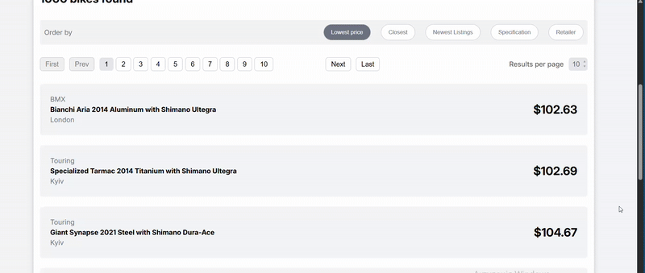
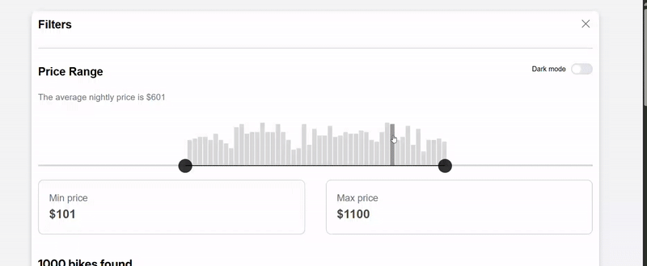
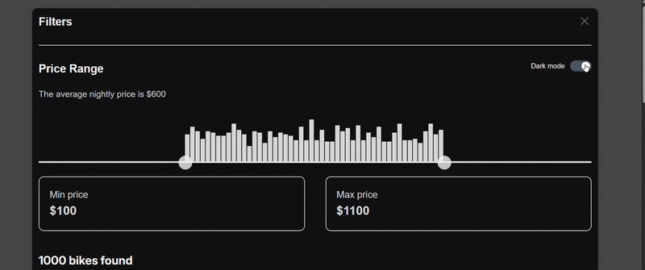

# 💸 Price-Range

**Price-Range** is a React + TypeScript web application that displays a list of product cards with pagination, price filtering, sorting options, and a light/dark theme toggle. It’s a simple and clean UI project built with mock data.

---

## 🖼 Demo





## 🔗 [Live Demo](https://pricerange.netlify.app/)

## 🔍 Features

- 🧾 Product card list with pagination
- 🎚 Price filtering with:
  - Double range slider
  - Interactive price histogram
- ↕️ Sorting options:
  - Lowest Price
  - Closest
  - Newest Listings
  - Specification
  - Retailer
- 🌗 Light/Dark theme toggle using React Context
- 🎯 Simple, responsive layout with CSS Modules

---

## ⚙️ Tech Stack

- React + Vite
- TypeScript
- CSS Modules
- Context API
- HTML inputs (`range`) + custom logic for histogram
- Mock data (no backend)

---

## 📦 Installation

```bash
git clone https://github.com/doboshdiana404/Price-Range.git
cd price-range
npm install
```

## 🚀 Run Locally

```bash
npm run dev
```

## Project Structure

src/
├── components/ # UI components
│ ├── Card/ # Product card
│ ├── CardsPage/ # Page layout + logic
│ ├── Pagination/ # Pagination controls
│ ├── PriceFilter/ # Histogram + slider
│ └── SortButtons/ # Sorting by criteria
├── context/
│ └── ThemeContext.tsx # Context for theme
├── data/
│ └── cards.ts # Mock product list
├── hooks/
│ └── ThemeProvider.tsx # Context provider logic
├── modules /CardList/
│ ├── CardList.tsx # Filtered + paginated list
│ └── types.ts # Card-related types
├── ui/
│ ├── CardsPerPageInput/ # UI for changing cards per page
│ └── ThemeToggle/ # Switch between light/dark theme
├── utils/
│ ├── generatePriceHistogram.ts # Helper for histogram bins
│ └── types.ts # Utility types
├── App.module.css
├── App.tsx
├── index.css
└── main.tsx

## 🌗 Theme Toggle

Theme switching is handled via React Context and CSS variables.  
The selected theme is saved in `localStorage`, so your preference persists across sessions.

```css
:root {
  --text-color: #000000;
  --background-cards: #f3f4f6;
}

.dark {
  --text-color: #f1f1f1;
  --background-cards: #474748;
}

body {
  background-color: var(--background-cards);
  color: var(--text-color);
  transition: background-color 0.3s, color 0.3s;
}
```

## Mock Data

The application uses mock data generated locally from `src/data/cards.ts`.  
Each card includes:

- `id` — unique identifier
- `title` — product name
- `description` — product description
- `price` — numeric value for filtering/sorting
- `city` — city name (used for mock sorting by "Closest")
- `year` — year release (used for mock sorting by "Newest Listings")

## ✍️ Author

Diana Dobosh
GitHub: @doboshdiana404
